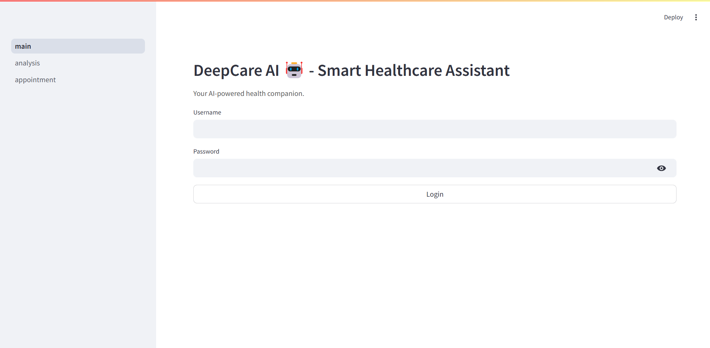
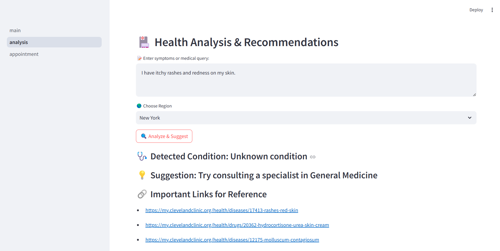
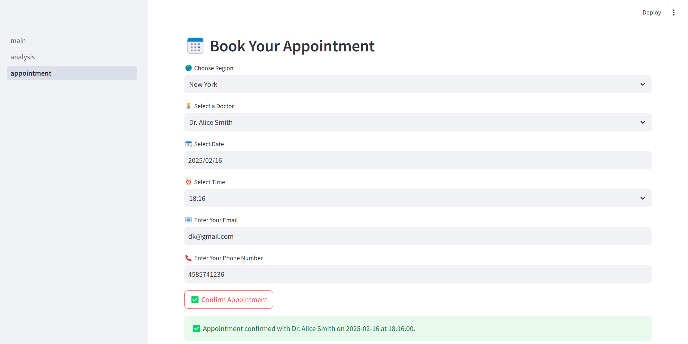

# 🩺 DeepCare AI - Smart Healthcare Assistant

DeepCare AI is an AI-powered **healthcare consultation assistant** that helps users analyze their symptoms, suggest possible conditions, and book appointments with specialists.

---

## 🚀 Features

✅ **Symptom Analysis** – AI-powered disease detection using DeepSeek AI  
✅ **Doctor Recommendations** – Find the best specialist based on your condition & location  
✅ **Appointment Booking** – Schedule a consultation with healthcare professionals  
✅ **Secure Authentication** – User login to ensure privacy (username = admin, password = password)

---

## 📂 Project Structure

```
deepcare_ai/
│── .env                     # API keys and sensitive data
│── .gitignore                # Ignore unnecessary files
│── main.py                   # Main Streamlit app
│── requirements.txt           # Dependencies
│── README.md                 # Documentation
│── config.py                 # Configuration settings
│── services/
│   ├── deepseek_api.py       # DeepSeek AI API interactions
│   ├── auth.py               # Authentication logic
│── data/
│   ├── doctors.py            # Doctor database
│   ├── regions.py            # List of available regions
│── utils/
│   ├── disease_mapping.py    # Disease to specialist mapping
│   ├── helper.py             # Utility functions
│── pages/
│   ├── analysis.py           # Symptom analysis
│   ├── appointment.py        # Booking system
│── assets/                   # Images, icons, etc.
```

---

## 🛠️ Installation & Setup

### 1️⃣ Clone the Repository

```sh
git clone https://github.com/your-username/deepcare-ai.git
cd deepcare-ai
```

### 2️⃣ Create & Activate a Virtual Environment (Optional)

```sh
python -m venv venv
source venv/bin/activate  # On macOS/Linux
venv\Scripts\activate   # On Windows
```

### 3️⃣ Install Dependencies

```sh
pip install -r requirements.txt
```

### 4️⃣ Set Up API Credentials

Create a **.env** file in the root directory and add:

```ini
API_URL="https://api.deepseek.com/v3/analyze"
API_KEY="your_deepseek_api_key"
```

---

## ▶️ Running the Application

```sh
streamlit run main.py
```

This will open the **DeepCare AI** app in your browser. 🌍

---

## 📸 Screenshots

| Home Page                | Symptom Analysis                 | Appointment Booking                    |
| ------------------------ | -------------------------------- | -------------------------------------- |
|  |  |  |

---

## 📜 License

This project is **open-source** under the **MIT License**.

---

## 🤝 Contributing

Want to improve DeepCare AI? Follow these steps:

1. **Fork** this repository 🍴
2. **Create** a new branch (`git checkout -b feature-name`)
3. **Commit** your changes (`git commit -m "Add feature"`)
4. **Push** the branch (`git push origin feature-name`)
5. **Submit** a Pull Request ✅

---

## 📩 Contact

💡 Have suggestions or questions? Connect with me:  
📧 **Email**: darshp554@gmail.com  
🔗 **Portfolio**: [darshak07.netlify.app](https://darshak07.netlify.app/)
